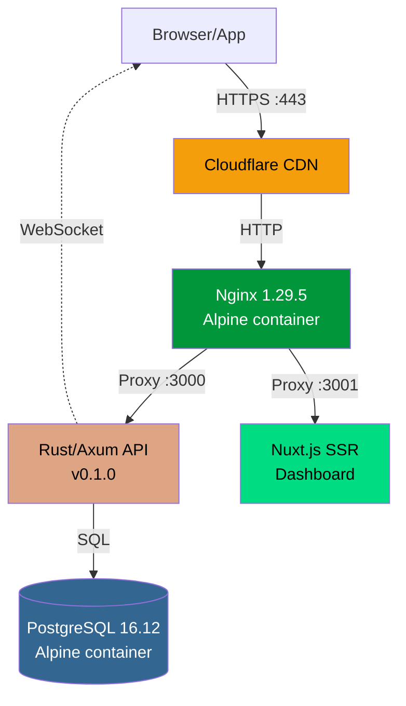
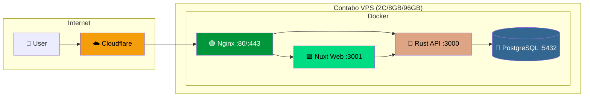

# 📊 Báo Cáo Hạ Tầng VPS — api.nodi.vn

> **Ngày**: 15/03/2026 | **Uptime**: 29 ngày | **Hostname**: srv1377210

---

## 1. Server Specs

```
┌─────────────────────────────────────────────────┐
│  Provider:  Contabo VPS                         │
│  OS:        Ubuntu 24.04.4 LTS (Noble Numbat)   │
│  CPU:       AMD EPYC 9354P — 2 cores @ 2.0GHz   │
│  RAM:       7.8 GB (used: 3.9 GB, free: 3.8 GB)│
│  Disk:      96 GB SSD (used: 47 GB — 49%)       │
│  Load avg:  0.09 / 0.12 / 0.08                  │
│  Uptime:    29 days, 2h34m                      │
└─────────────────────────────────────────────────┘
```

---

## 2. Software Stack



| Component | Version | Container | Image Size |
|-----------|---------|-----------|------------|
| Nginx | 1.29.5 | `nodi-nginx` | 93 MB |
| Rust/Axum API | 0.1.0 | `nodi-api` | 148 MB |
| PostgreSQL | 16.12 | `nodi-postgres` | 395 MB |
| Nuxt.js Web | — | `nodi-web` | 337 MB |

**SSL**: Google Trust Services (WE1)
- Issued: 14/02/2026
- Expires: **15/05/2026** ⚠️ (cần renew trước)
- Domain: `nodi.vn`

---

## 3. API Endpoints

Tổng cộng **103 endpoints**. Phân nhóm:

### Auth & Account (8)
| Method | Path | Mô tả |
|--------|------|-------|
| POST | `/api/login` | Đăng nhập (account system) |
| POST | `/api/register` | Đăng ký tài khoản |
| POST | `/api/login-with-license` | Đăng nhập bằng license key |
| POST | `/api/auth/register` | Đăng ký (store system) |
| POST | `/api/auth/refresh` | Refresh JWT token |
| POST | `/api/unbind-device` | Gỡ liên kết thiết bị |
| POST | `/api/update-phone` | Cập nhật SĐT |
| GET | `/api/verify-license` | Xác thực license |

### Sync (3)
| Method | Path | Mô tả |
|--------|------|-------|
| POST | `/api/sync` | Push data lên cloud |
| GET | `/api/sync/pull` | Pull data từ cloud |
| WS | `/ws/sync` | WebSocket real-time notification |

### Dashboard (16)
| Path | Mô tả |
|------|-------|
| `/api/dashboard/summary` | Tổng quan |
| `/api/dashboard/orders` | Danh sách đơn hàng |
| `/api/dashboard/orders/{id}` | Chi tiết đơn |
| `/api/dashboard/inventory` | Kho hàng |
| `/api/dashboard/inventory/export` | Xuất Excel kho |
| `/api/dashboard/debts` | Công nợ |
| `/api/dashboard/purchase-orders` | Đơn nhập hàng |
| `/api/dashboard/reports/revenue` | Báo cáo doanh thu |
| `/api/dashboard/reports/top-products` | Sản phẩm bán chạy |
| `/api/dashboard/staff` | Nhân viên |
| `/api/dashboard/settings` | Cài đặt |
| `/api/dashboard/notifications` | Thông báo |
| `/api/dashboard/accounting/*` | Kế toán (4 endpoints) |
| `/api/dashboard/einvoice/*` | Hóa đơn điện tử (2 endpoints) |

### Admin (35)
- `/api/admin/overview` — Tổng quan hệ thống
- `/api/admin/stores` — Quản lý cửa hàng
- `/api/admin/licenses` — Quản lý license
- `/api/admin/accounts` — Quản lý tài khoản
- `/api/admin/orders` — Đơn hàng toàn hệ thống
- `/api/admin/intelligence/*` — Phân tích thị trường
- `/api/admin/market/*` — Market overview
- `/api/admin/support/*` — Hỗ trợ khách hàng
- `/api/admin/billing/*` — Thanh toán
- `/api/admin/export/*` — Xuất báo cáo
- `/api/admin/update/*` — Quản lý bản cập nhật
- *...và 20+ endpoints khác*

### Store Management (3)
| `/api/stores` | `/api/stores/create` | `/api/stores/switch` |

### Support (7)
- REST: `/api/support/ticket`, `/my-tickets`, `/{id}/reply`, `/{id}/close`, `/{id}/status`, `/{id}/messages`
- WebSocket: `/api/support/ws`

### Others (31)
- Backup: `/api/backup/list`, `/download`, `/upload`
- Payment: `/api/payment/create-order`, `/check/{code}`, `/webhook`
- Scanner: `/api/scanner/connect`, `/scan`, `/status`
- Staff Invite: `/api/staff-invite/create`, `/list`, `/redeem`
- Devices: `/api/devices`, `/api/devices/{id}`
- Downloads: `/api/downloads/info`
- Upload: `/api/upload`
- Health: `/api/health`
- Update: `/api/check-update`, `/api/update/check`, `/api/check-activation`

---

## 4. Database Schema

**PostgreSQL 16.12** — Total: ~2.3 MB (thấp — hệ thống early-stage)

### Bảng chính (44 tables)

| Bảng | Rows | Size | Mô tả |
|------|------|------|-------|
| `synced_products` | 164 | 176 KB | Sản phẩm đồng bộ |
| `synced_product_units` | 168 | 112 KB | Đơn vị tính SP |
| `synced_invoices` | 22 | 112 KB | Hóa đơn bán hàng |
| `stores` | 0 | 112 KB | Cửa hàng (license system) |
| `synced_product_transactions` | 20 | 96 KB | Phiếu xuất/nhập kho |
| `synced_cash_transactions` | 17 | 96 KB | Sổ quỹ |
| `synced_customers` | 14 | 96 KB | Khách hàng |
| `synced_invoice_items` | 13 | 96 KB | Chi tiết hóa đơn |
| `sync_staff_members` | 13 | 96 KB | Nhân viên |
| `synced_customer_transactions` | 10 | 64 KB | Công nợ KH |
| `synced_suppliers` | 7 | 80 KB | Nhà cung cấp |
| `synced_product_batches` | 7 | 48 KB | Lô hàng |
| `accounts` | 5 | 64 KB | Tài khoản đăng nhập |
| `devices` | 6 | 80 KB | Thiết bị đã kích hoạt |
| `account_stores` | 3 | 56 KB | Mapping account↔store |
| *...29 bảng khác* | | | |

### Indexes

Mỗi bảng `synced_*` có unique index trên `(store_id, local_id)` hoặc `(store_id, client_id)` — đảm bảo upsert.

### PostgreSQL Tuning

| Parameter | Value | Note |
|-----------|-------|------|
| `shared_buffers` | 2 GB | 25% RAM ✅ |
| `work_mem` | 32 MB | OK cho queries nhỏ |
| `maintenance_work_mem` | 256 MB | ✅ |
| `effective_cache_size` | 5 GB | ~64% RAM ✅ |
| `max_connections` | 100 | Đủ cho scale hiện tại |
| `max_wal_size` | 2 GB | ✅ |

---

## 5. Security

### Firewall (UFW Active ✅)

```
Rule    Port    Action
─────   ────    ──────
SSH     22      ALLOW
HTTP    80      ALLOW
HTTPS   443     ALLOW
(tất cả cổng khác: DROP)
```

### Rate Limiting

🔴 **KHÔNG CÓ** — đã bỏ `tower_governor` (Sprint 113) do conflict với Cloudflare IP.
Hiện tại chỉ dựa vào:
- JWT authentication
- Cloudflare DDoS protection

### CORS

```
Origins: https://nodi.vn, https://www.nodi.vn, https://api.nodi.vn
Methods: GET, POST, PUT, PATCH, DELETE, OPTIONS
Headers: Content-Type, Authorization, Accept, Origin
Credentials: true
```

### JWT Config

| Token | Expiry |
|-------|--------|
| Access Token | **24 giờ** |
| Refresh Token | **30 ngày** |
| Algorithm | HS256 (default) |

### Nginx Security Headers

```
X-Content-Type-Options: nosniff
X-Frame-Options: DENY
X-XSS-Protection: 1; mode=block
Referrer-Policy: strict-origin-when-cross-origin
Content-Security-Policy: (đầy đủ CSP rules)
```

### Other

- Fail2ban: ❌ Không chạy
- SSH: Password auth (khuyến nghị chuyển key-only)
- DB: Chỉ bind `127.0.0.1:5432` — không expose ra ngoài ✅

---

## 6. Monitoring & Logs

| Item | Status | Detail |
|------|--------|--------|
| API Logs | ✅ Docker stdout | `docker logs nodi-api` |
| Nginx Access Log | ✅ Container log | `/var/log/nginx/access.log` |
| Nginx Error Log | ✅ Container log | `/var/log/nginx/error.log` |
| Uptime Monitoring | ❌ Không | Chưa có UptimeRobot/Healthchecks |
| Error Tracking | ❌ Không | Chưa có Sentry/Datadog |
| Automated Backup | ❌ Không | Chưa có pg_dump cron |
| Log Rotation | ⚠️ Docker default | Nếu log quá lớn sẽ chiếm disk |

### Nginx Error Log (gần nhất)

```
[warn] a client request body is buffered to a temporary file
→ POST /api/sync payload lớn, Nginx buffer vào disk
→ Recommendation: tăng client_body_buffer_size
```

---

## 7. Bottlenecks & Khuyến nghị

### 🔴 Critical

| # | Vấn đề | Impact | Khuyến nghị |
|---|--------|--------|------------|
| 1 | **Không có backup tự động** | Mất dữ liệu nếu disk fail | Thêm cron `pg_dump` hàng ngày |
| 2 | **SSL hết hạn 15/05/2026** | Web + API sẽ chết | Thiết lập auto-renew certbot |
| 3 | **Không có rate limiting** | DDoS / brute-force risk | Thêm rate limit ở Nginx layer |

### 🟡 Warning

| # | Vấn đề | Impact | Khuyến nghị |
|---|--------|--------|------------|
| 4 | **Nginx buffer warning** | Sync payload lớn bị buffer disk | Tăng `client_body_buffer_size 2m` |
| 5 | **Fail2ban không chạy** | SSH brute-force risk | Enable fail2ban cho SSH |
| 6 | **Không có uptime monitoring** | Không biết khi nào API chết | Thêm UptimeRobot/Healthchecks.io |
| 7 | **Disk 49% used** | Sẽ đầy nếu log/data tăng | Monitor disk, setup log rotation |

### 🟢 Strengths

| # | Item | Status |
|---|------|--------|
| 1 | Docker containerization | Tốt — isolated, reproducible |
| 2 | PostgreSQL tuning | Tốt — đã optimize cho 8GB VPS |
| 3 | UFW firewall | Tốt — chỉ expose 3 ports |
| 4 | Cloudflare CDN | Tốt — DDoS protection + SSL |
| 5 | Rust/Axum API | Tốt — low memory, high performance |
| 6 | WebSocket sync | Mới — real-time <1s latency |

### Khả năng chịu tải (ước tính)

```
Concurrent connections:  ~500-1000 (Nginx + Rust async)
API latency:             <50ms (health), ~200ms (login), ~100ms (sync)
DB queries:              <10ms trung bình (data nhỏ, index tốt)
WebSocket:               ~100 concurrent connections (tokio async)
Max sync payload:        50MB (API limit) — Nginx buffers ~1MB
Memory headroom:         ~3.8 GB free
```

---

## 8. Architecture Diagram



---

## 9. Disk Usage

| Thư mục | Size | Nội dung |
|---------|------|----------|
| `/opt/nodi/data/` | 71 MB | PostgreSQL data |
| `/opt/nodi/downloads/` | 205 MB | APK + EXE installers |
| Docker images | ~973 MB | 4 containers |
| **Tổng /opt/nodi/** | ~1.5 GB | |
| **Disk used** | 47 GB / 96 GB | 49% |

---

*Report generated: 15/03/2026 18:00 UTC (01:00 VN 16/03)*
