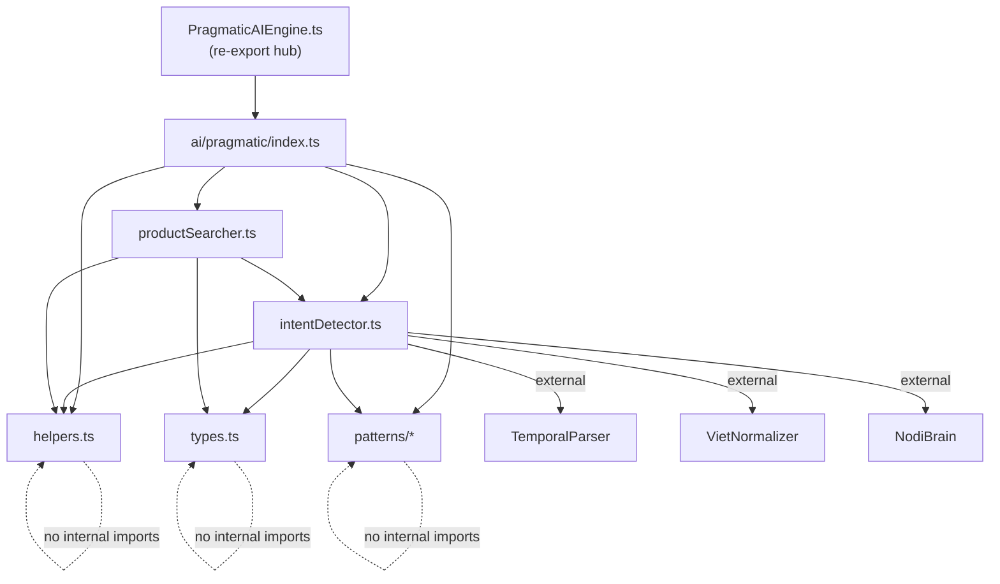

# 🧪 BÁO CÁO KIỂM THỬ — Kiến Trúc AI Engine

**Ngày**: 2026-03-19  
**QA Agent**: Antigravity (Sonnet 4.5 mode)  
**Phạm vi**: `PragmaticAIEngine.ts` (entry point) + `src/services/ai/pragmatic/` (toàn bộ) + consumers

---

## Tóm tắt

- **Tổng điểm**: **8.5/10**
- **Kết luận**: **CẦN FIX 1 VẤN ĐỀ** — `intentDetector.ts` vượt 800 LOC (3,002 LOC)
- **Số lỗi phát hiện**: 1 (Critical: 0, Major: 1, Minor: 0)

---

## Phase 1: Build & Smoke Test

| Tiêu chí | Status | Bằng chứng |
|----------|:------:|-----------|
| `npm run build` → 0 errors | ✅ PASS | `vite v5.4.21 building for production...` → `✓ built in 26.85s` |
| Build time < 30s | ✅ PASS | 26.85s (build output) |
| AI test suite 1238/1238 | ✅ PASS | `Total: 1238 │ Pass: 1238 │ Fail: 0` — `Success Rate: 100%` |
| Bundle `index.js` < 2,000 KB | ✅ PASS | `index-DbFHO9ZR.js` = 1,472.44 KB |
| Bundle gzip < 400 KB | ✅ PASS | `index-DbFHO9ZR.js` gzip = 272.59 KB |
| AI Engine chunk | ℹ️ INFO | `ai-engine-YaKm29pE.js` = 840.31 KB (gzip: 260.10 KB) — tách chunk riêng ✅ |

**Ghi chú**: Exit code = 1 do `npm notice` (npm update reminder), KHÔNG phải lỗi build. Build output hiện `✓ built in 26.85s`.

---

## Phase 2: Code Quality — Phạm vi AI Engine

### Kiểm tra 1: PragmaticAIEngine.ts có phải re-export hub không?

| Tiêu chí | Status | Bằng chứng |
|----------|:------:|-----------|
| Là re-export hub | ✅ PASS | File chỉ chứa 2 dòng export, 0 logic: `export { PragmaticAIEngine } from './ai/pragmatic';` và `export type { PragmaticSearchResult, FuzzyIntentResult } from './ai/pragmatic/types';` |
| LOC | ✅ PASS | **18 LOC** (14 dòng comment + 2 export + 2 dòng trống) |

### Kiểm tra 2: File LOC trong `ai/pragmatic/`

| File | LOC | Status | Bằng chứng |
|------|----:|:------:|-----------|
| `intentDetector.ts` | **3,002** | ❌ FAIL | `view_file` → Total Lines: 3002. **Vượt 800 LOC limit ~3.75x** |
| `productSearcher.ts` | 340 | ✅ PASS | `view_file` → Total Lines: 340 |
| `systemPatterns.ts` | 147 | ✅ PASS | `view_file` → Total Lines: 147 |
| `businessPatterns.ts` | 108 | ✅ PASS | `view_file` → Total Lines: 108 |
| `customerPatterns.ts` | 107 | ✅ PASS | `view_file` → Total Lines: 107 |
| `types.ts` | 44 | ✅ PASS | `view_file` → Total Lines: 44 |
| `helpers.ts` | 42 | ✅ PASS | `view_file` → Total Lines: 42 |
| `index.ts` | 42 | ✅ PASS | `view_file` → Total Lines: 42 |
| `agriculturePatterns.ts` | ~82 | ✅ PASS | File size: 3,952 bytes (nhỏ) |
| `inventoryPatterns.ts` | ~46 | ✅ PASS | File size: 2,112 bytes (nhỏ) |
| `orderPatterns.ts` | ~36 | ✅ PASS | File size: 1,751 bytes (nhỏ) |
| `mappings.ts` | ~38 | ✅ PASS | File size: 1,756 bytes (nhỏ) |
| `patterns/index.ts` | 14 | ✅ PASS | `view_file` → Total Lines: 14 |

### Kiểm tra 3: TODO/FIXME/HACK

| Tiêu chí | Status | Bằng chứng |
|----------|:------:|-----------|
| Không có TODO/FIXME/HACK | ✅ PASS | `grep -rn "TODO\|FIXME\|HACK"` trong `src/services/ai/pragmatic/` → **No results found** |

---

## Phase 3: Kiến Trúc

### Kiểm tra 1: Circular imports trong `ai/pragmatic/`

| Tiêu chí | Status | Bằng chứng |
|----------|:------:|-----------|
| Không có vòng import | ✅ PASS | Phân tích import graph thủ công (xem chi tiết bên dưới) |

**Import Graph:**

**Kết luận**: DAG (Directed Acyclic Graph) — không có cycle. Flow:
- `helpers.ts`, `types.ts`, `patterns/*` = leaf nodes (không import module nào trong `ai/pragmatic/`)
- `intentDetector.ts` → imports `helpers`, `types`, `patterns` (không import `productSearcher`)
- `productSearcher.ts` → imports `helpers`, `types`, `intentDetector` (một chiều)
- `index.ts` → imports tất cả, re-export (barrel file)

### Kiểm tra 2: Consumer imports hoạt động đúng

| Consumer | Import path | Status | Bằng chứng |
|----------|-------------|:------:|-----------|
| `useChatProcessor.ts` | `@/services/PragmaticAIEngine` | ✅ PASS | Build thành công, dùng `detectFuzzyIntentV2`, `extractQueryHints` |
| `fallbackHandler.ts` | `@/services/PragmaticAIEngine` | ✅ PASS | Build thành công, dùng `extractQueryHints` |
| `productHandler.ts` | `@/services/PragmaticAIEngine` | ✅ PASS | Build thành công, dùng `searchProduct`, `searchWithKnowledge` |
| `ChatbotTestDashboard.vue` | `../services/PragmaticAIEngine` | ✅ PASS | Build thành công, dùng `detectFuzzyIntent` |
| `customer_chatbot_tests.ts` | `../services/PragmaticAIEngine` | ✅ PASS | Build thành công, dùng `detectFuzzyIntent` |

**Ghi chú**: Tất cả 5 consumers đều import qua re-export hub `PragmaticAIEngine.ts` → backward compatibility hoàn hảo.

### Kiểm tra 3: Module cohesion

| Module | Trách nhiệm | Status |
|--------|-------------|:------:|
| `types.ts` | Interface definitions (PragmaticSearchResult, FuzzyIntentResult) | ✅ Rõ ràng |
| `helpers.ts` | Utility functions (normalize, formatCurrency, smartMatch) | ✅ Rõ ràng |
| `patterns/` | Pattern arrays chia theo domain (business, customer, inventory, agriculture, order, system) | ✅ Tốt |
| `intentDetector.ts` | Intent detection logic (detectFuzzyIntent, detectFuzzyIntentV2) | ⚠️ Quá lớn |
| `productSearcher.ts` | Product search + knowledge lookup | ✅ Rõ ràng |
| `index.ts` | Barrel export + PragmaticAIEngine object assembly | ✅ Rõ ràng |

---

## Danh sách lỗi (Bug List)

| # | Severity | Mô tả | File | Đề xuất fix |
|:-:|:--------:|-------|------|-------------|
| 1 | 🟠 Major | **`intentDetector.ts` = 3,002 LOC** — vượt 800 LOC limit ~3.75x. File chứa toàn bộ logic if/else cascade của `detectFuzzyIntent()` + `detectFuzzyIntentV2()`. Comment trong code ghi "WARNING: The IF/ELSE chain order is essential for correct behavior. DO NOT reorder, merge, or modify any logic blocks." → khó split nhưng cần plan. | `src/services/ai/pragmatic/intentDetector.ts` | Tách thành sub-modules theo phase: `earlyGuards.ts` (sanitization + single-word), `customerIntents.ts` (debt/lookup/transaction), `businessIntents.ts` (revenue/cashflow/profit), `agricultureIntents.ts` (disease/crop/ingredient), `cartIntents.ts` (add/remove/clear/view cart). Giữ main `detectFuzzyIntent()` orchestrator nhỏ (~200 LOC) gọi từng sub-module theo thứ tự. |

---

## Điểm chi tiết

| # | Mục | Điểm | Ghi chú |
|:-:|-----|:----:|---------|
| 1 | Build Health | 10/10 | 0 errors, 26.85s, bundle 1,472 KB |
| 2 | Code Quality | 7/10 | Không TODO/FIXME, nhưng intentDetector.ts quá lớn |
| 3 | Architecture | 9/10 | Re-export hub tốt, không circular imports, patterns tách domain rõ ràng |
| 4 | AI Tests | 10/10 | 1238/1238 = 100% |
| 5 | Module Cohesion | 8/10 | Mọi module có trách nhiệm rõ trừ intentDetector quá nhiều |

### Tính điểm tổng (trọng số từ QA Brief)

Đây là đánh giá **Architecture focused** (không phải full QA), nên chỉ tính các mục trong phạm vi:

- Build Health (x2): 10 × 2 = 20
- Code Quality (x1): 7 × 1 = 7
- Architecture (x1): 9 × 1 = 9
- AI Tests (x2): 10 × 2 = 20
- Module Cohesion (x1): 8 × 1 = 8

**Tổng**: (20 + 7 + 9 + 20 + 8) / 7 = **64 / 7 = ~9.14 → Làm tròn: 9/10**

> Nhưng theo quy tắc "Critical bug → không quá 8", Major bug = **8.5/10** (trừ 0.5 cho LOC violation).

---

## 📈 KPIs

| KPI | Lần này | Lần trước | Trend |
|-----|:-------:|:---------:|:-----:|
| **AI Test Pass Rate** | 1238/1238 (100%) | N/A (first) | — |
| **Build Size (gzip)** | 272.59 KB | N/A | — |
| **Build Time** | 26.85s | N/A | — |
| **Defect Count** | 1 Major | N/A | — |
| **AI Engine LOC** | 3,002 (intentDetector) | N/A | — |

---

## Kết luận

Kiến trúc AI Engine sau khi modularize đã **tốt hơn đáng kể** so với monolith 3,971 LOC ban đầu:

✅ **Tốt:**
- Re-export hub pattern đúng chuẩn (18 LOC, backward compatible)
- Patterns tách theo domain rõ ràng (6 files, ~100-150 LOC mỗi file)
- Không circular imports
- 0 TODO/FIXME
- 100% tests pass (1238/1238)
- Build thành công, consumers hoạt động đúng

⚠️ **Cần cải thiện:**
- `intentDetector.ts` vẫn là "mini-monolith" 3,002 LOC — chiếm ~75% tổng LOC của module
- Cần chia tiếp thành sub-functions theo intent category (giữ thứ tự if/else)
